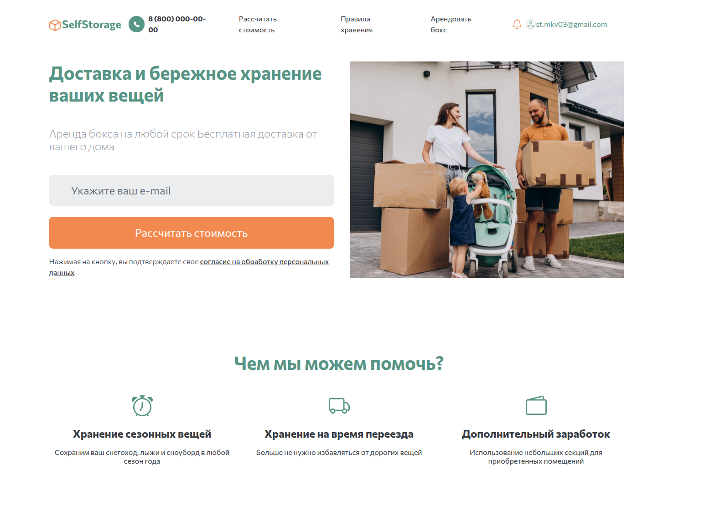

# Сайт по аренде боксов для личных нужд и бизнеса

Сайт предоставляет возможность арендовывать боксы на складах в раных городах. А также получить к ним доступ по средством сканирования QR кода. Также реализовано продление хранения.





## Как запустить

Разработка велась на python 3.12 - работоспособность гарантирована.

Необходимо создать файл `.env` и поместить туда следующую информацию

```
SECRET_KEY="django-insecure-*********3bejr#9^7z"
DEBUG=True
ALLOWED_HOSTS=127.0.0.1
VPS_ADDRESS="127.0.0.1:8000" <Адрес где будет работать ваш сайт>
EMAIL_HOST_PASSWORD="qllx **** **** ****"

```

После чего необходимо установить все зависимости командой

```
uv install
```
